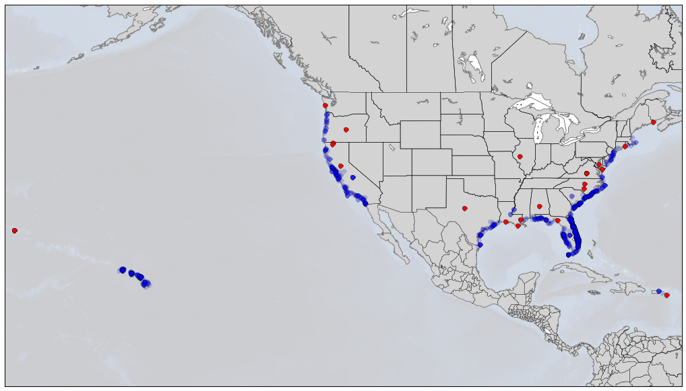

# Sharks

A "deep dive" into global shark attack data.  Some questions we'll try to answer:

- What types of activities are most correlated with shark attacks?
- Where do most shark attacks occur?
- What species are responsible for the most attacks (fatal attacks)?

In doing this, we'll do a bit of plotting (barcharts and the like), as well as attempt to visualize the geospatial nature of shark attacks!

A preview of one of our plots (note the "Landsharks!")

Packages we'll use (also listed in our `requirements.txt` file):

| Package       |    Version    |
| ------------- | ------------- |
| ggplot        |   0.11.5      |
| matplotlib    |   1.5.3       |
| numpy         |   1.11.3      |
| pandas        |   0.19.1      |
| geopy         |   1.11.0      |
| scikit_learn  |   0.18.1      |

Files include:

* GSAF5.xls                              File from ISAF (http://www.sharkattackfile.net/spreadsheets/GSAF5.xls)
* Rodeo_sharks_part1.py                  Part 1 of script (plotting, activites)
* Rodeo_sharks_part2.py                  Part 2 of script (get our geocoordinates and plot them)
* fatal_shark_attacks_by_activity.png
* shark_activities.png
* shark_attacks_by_activity_type.png
* sharks_coords.csv                      csv with longitude and latitude computed
